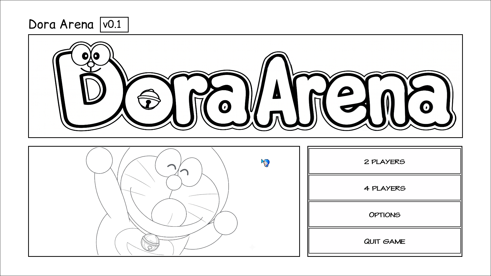
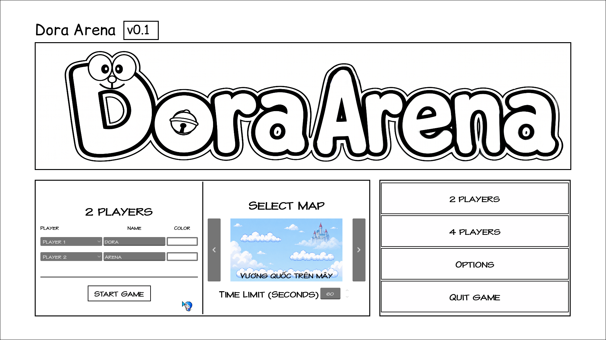
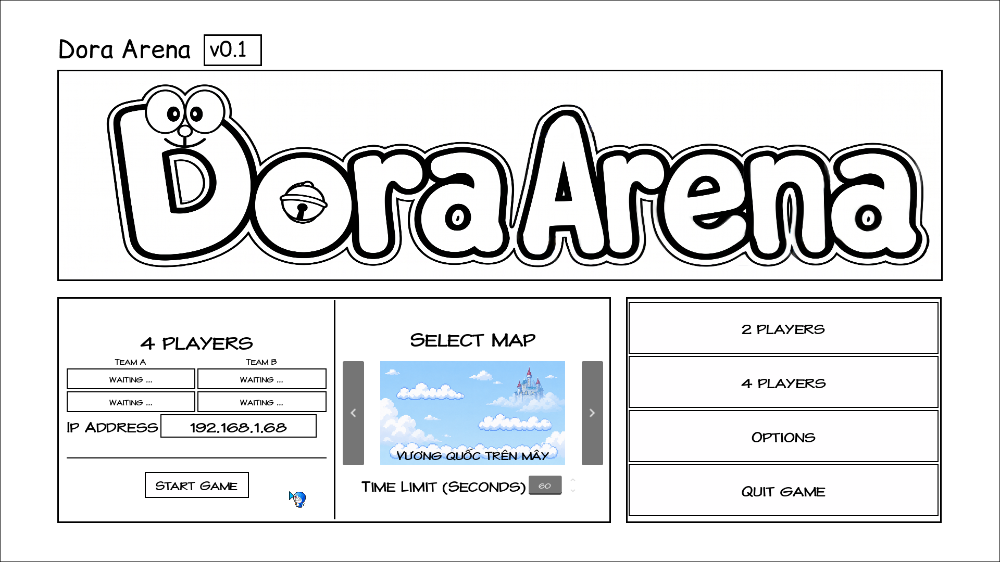
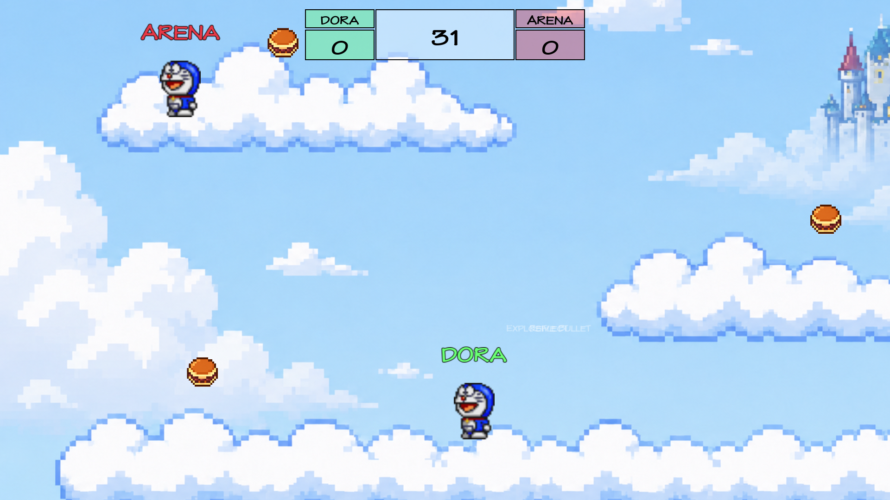
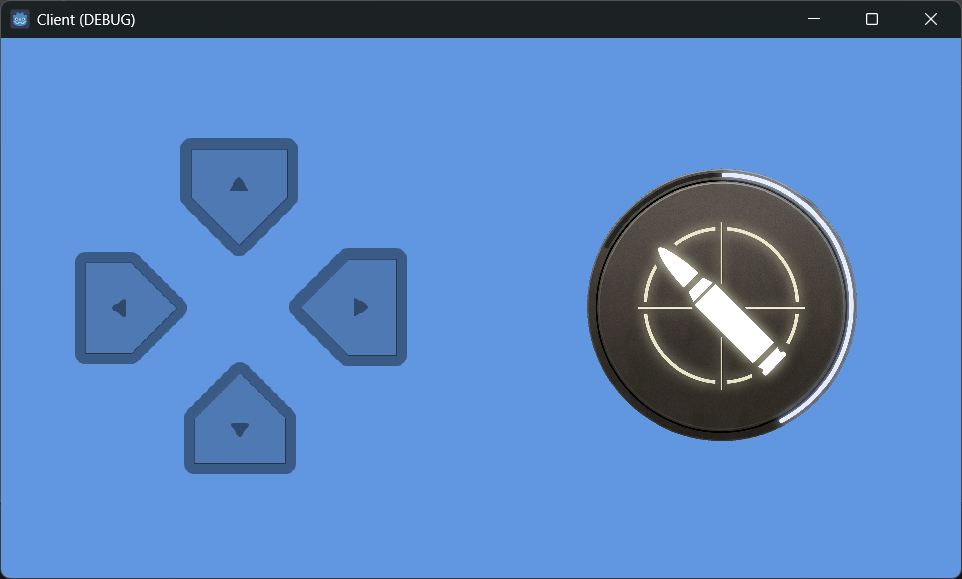

<div align="center">

# Dora Arena

**2D Platform Arena Shooter inspired by Gun Mayhem and Doraemon Movies**

Local Multiplayer • LAN Multiplayer • Knockback Combat • Godot 4

</div>

---

## About The Project

Dora Arena là game đối kháng platform arena 2D lấy cảm hứng từ các web game multiplayer cổ điển như Gun Mayhem, Y8 và GameVui kết hợp với thế giới Doraemon.

Gameplay tập trung vào các trận đấu ngắn có nhịp độ nhanh, nơi người chơi phải di chuyển, double jump, né đạn và sử dụng “Đại bác không khí” để tạo knockback đẩy đối thủ rơi khỏi bản đồ thay vì dùng hệ thống HP truyền thống.

Project được phát triển bằng Godot Engine 4 với mục tiêu xây dựng một game multiplayer có kiến trúc module hóa, hỗ trợ Local Multiplayer và LAN Multiplayer thông qua ENet + RPC.

---

# Screenshots

## Main Menu



## Local Multiplayer Lobby



## LAN Multiplayer Lobby



## Gameplay



---

# Features

* Local Multiplayer
* LAN Multiplayer (ENet + RPC)
* Knockback-based Combat
* Double Jump Movement
* Power-up / Buff System
* Explosive Bullet
* Reflect Bullet
* Sudden Death Phase
* Bot AI
* Runtime Localization (EN/VI)
* Custom Keybind System
* Persistent Settings Save/Load

---

# Tech Stack

| Technology     | Purpose                |
| -------------- | ---------------------- |
| Godot Engine 4 | Game Engine            |
| GDScript       | Programming Language   |
| ENet + RPC     | Multiplayer Networking |
| Git/GitHub     | Version Control        |
| Piskel         | Pixel Art              |

---

# Project Structure

```text id="2ppkwo"
res://
├── addons/
├── assets/
├── data/
├── src/
│   ├── autoload/
│   ├── bot/
│   ├── bullet/
│   ├── effects/
│   ├── game/
│   ├── map/
│   ├── network/
│   ├── player/
│   ├── shared/
│   └── ui/
└── themes/
```

Project được tổ chức theo hướng module hóa, mỗi hệ thống gameplay được tách thành các module độc lập nhằm dễ mở rộng và bảo trì.

---

# Controls

| Action | Player 1 | Player 2 |
|---|---|---|
| Move Left | A | ← |
| Move Right | D | → |
| Jump | W | ↑ |
| Shoot | F | K |

## Mobile Client



---

# Getting Started

## Requirements

* Godot Engine 4.x

## Clone Repository

```bash id="blqqcf"
git clone https://github.com/your-username/dora-arena.git
```

## Run Project

Mở project bằng Godot Engine 4 và chạy scene chính trong thư mục `host`.

---

# Team

| Member             | Role                         |
| ------------------ | ---------------------------- |
| Phan Lê Xuân Mạnh  | Lead Developer / Multiplayer |
| Liêng Hót Ha Luyến | UI / Documentation           |
| Mai Quý Phước      | Gameplay Developer           |
| Phan Thị Bảo Trâm  | QA / Asset Support           |

---

# Future Improvements

* Online Multiplayer
* More Maps
* More Weapons & Effects
* Better AI
* Mobile / Web Export
* Improved Visual Effects
* Better Gameplay Balancing

---

# License

This project was developed for educational purposes.
